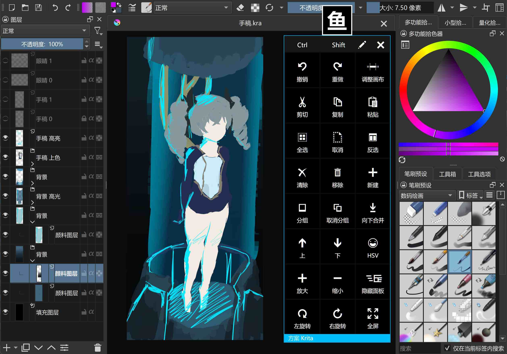

# 绘键-WPF

 
Github Releases 地址:  
[下载 绘键 (x64) - Github Releases](https://github.com/ysdy44/Paint-Keyboard-WPF/releases/download/v1.0.1/Paint.Keyboard.x64.exe)   
[下载 绘键 (x86) - Github Releases](https://github.com/ysdy44/Paint-Keyboard-WPF/releases/download/v1.0.1/Paint.Keyboard.x86.exe)   
 码云 发行版 地址:   
[下载 绘键 (x64) - 码云 发行版](https://gitee.com/ysdy44/paint-keyboard-wpf/attach_files/998390/download/Paint%20Keyboard%20(x64).exe)   
[下载 绘键 (x86) - 码云 发行版](https://gitee.com/ysdy44/paint-keyboard-wpf/attach_files/998391/download/Paint%20Keyboard%20(x86).exe)   

 

## 功能说明

绘画快捷键工具，可以模拟快捷键，支持编辑。 如果你在使用 SAI、Krita、Affinity Photo 绘画时需要快捷键键盘不妨试试。

 

## 开发环境

|Key|Value|
|:-|:-|
|系统要求| .NET Framework 4.8 或更高|
|开发工具|Visual Studio 2022|
|编程语言|C#|
|显示语言|中文 and English|
|评论语言|中文|

 

## 部署说明

> 下载整个工程，运行`Paint Keyboard.sln`，启动工程`Paint Keyboard`，试试看是否可以工作。